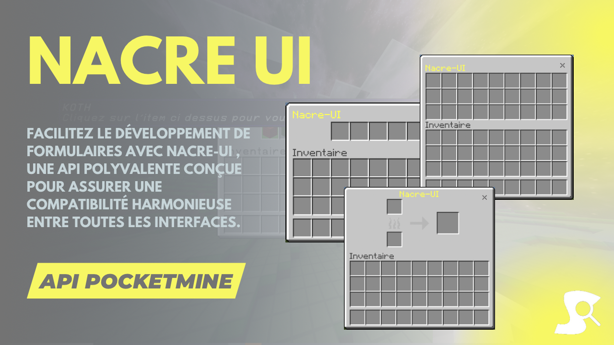

# Nacre-UI API 📝

Facilitez le développement de formulaires avec Nacre-UI, une API polyvalente conçue pour assurer une compatibilité harmonieuse entre toutes les interfaces.

## Fonctionnalités disponibles
- Formulaire
- GUI
- BossBar
- ScoreBoard
- Caméra

## Installation
Pour installer [Nacre-UI](https://github.com/Synopsie/Nacre-UI) dans votre projet, si vous utilisez [composer](https://getcomposer.org/):
`````injectablephp
composer require synopsie/nacre-ui
`````

Si vous n'utilisez pas [composer](https://getcomposer.org/), alors je vous invite à mettre l'API entièrement dans votre projet, et a changer les namespaces.

## Documentation

[Lien vers la coumentation](https://nacre.arkaniastudios.com/home.html)

## Support

Besoin d'aide ou avez-vous des questions ? N'hésitez pas à nous contacter ou à consulter la documentation pour obtenir des informations supplémentaires.

## Crédits

Nacre-UI est développé par [Synopsie](https://arkaniastudios.com). Merci à toute l'équipe pour son travail acharné et son dévouement à améliorer l'expérience de développement pour la communauté Minecraft.

- CameraAPI by kaxyum

Profitez de la facilité de développement offerte par Nacre-UI et évitez les tâches fastidieuses grâce à cette API pratique ! 🛠️

